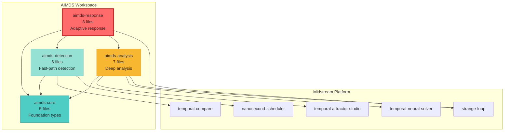

# AIMDS Dependency Graph Analysis

## Current Dependency Structure (Serial Compilation)

```
┌─────────────────────────────────────────────────────────────────┐
│                    Compilation Timeline                          │
│                         (Serial)                                 │
└─────────────────────────────────────────────────────────────────┘

Time: 0m ────────> 2m ────────> 5m ────────> 9m ────────> 14m

      ┌──────────┐   ┌─────────────┐   ┌──────────────┐   ┌──────────────┐
      │          │   │             │   │              │   │              │
      │  CORE    │──▶│  DETECTION  │──▶│   ANALYSIS   │──▶│   RESPONSE   │
      │  5 files │   │  6 files    │   │   7 files    │   │   8 files    │
      │          │   │             │   │              │   │              │
      └──────────┘   └─────────────┘   └──────────────┘   └──────────────┘
          │               │                   │                    │
          │               ├──────────┐        ├───────────┐        │
          │               │          │        │           │        │
          v               v          v        v           v        v
      [serde]      [temporal-   [scheduler]  [attractor] [neural] [strange-
                    compare]                              solver]   loop]
```

### Dependency Details

**aimds-core** (Foundation)
- 5 Rust files
- Dependencies: serde, tokio, thiserror, uuid, chrono
- Compile time: ~2 minutes
- No AIMDS dependencies

**aimds-detection** (Layer 1)
- 6 Rust files
- Dependencies: core + temporal-compare, scheduler, regex, blake3
- Compile time: ~3 minutes
- Waits for: core

**aimds-analysis** (Layer 2)
- 7 Rust files
- Dependencies: core + attractor, neural-solver, strange-loop, ndarray, petgraph
- Compile time: ~4 minutes
- Waits for: core

**aimds-response** (Layer 3) ⚠️ BOTTLENECK
- 8 Rust files
- Dependencies: core + detection + analysis + strange-loop
- Compile time: ~5 minutes
- Waits for: core, detection, analysis (SERIAL!)

**Total worst-case compile time:** 14 minutes

## Critical Issues

### Issue 1: Serial Compilation Chain

```
Response waits for everything:

    aimds-core (2m)
         ↓
    aimds-detection (3m)
         ↓
    aimds-analysis (4m)
         ↓
    aimds-response (5m) ← WAITS FOR ALL
```

**Problem:** Response can't start compiling until Analysis completes, but it doesn't actually need Analysis's implementation - only its types!

### Issue 2: Workspace Dependency Inconsistency

```toml
# aimds-response (WRONG)
thiserror = "2.0"  # Different version!
tokio = { version = "1.41", features = ["full"] }

# Workspace (CORRECT)
thiserror = "1.0"
tokio = { version = "1.35", features = ["full"] }
```

**Impact:** Cargo compiles thiserror twice (versions 1.0 and 2.0)

### Issue 3: No Feature Flags

All dependencies compiled even when not needed:

```
$ cargo build --no-default-features
ERROR: no-default-features not defined

$ cargo tree
# Compiles ALL of ndarray, petgraph, statrs even for minimal build
```

## Optimized Dependency Structure (Parallel Compilation)

```
┌─────────────────────────────────────────────────────────────────┐
│                    Compilation Timeline                          │
│                        (Parallel)                                │
└─────────────────────────────────────────────────────────────────┘

Time: 0m ────────> 2m ────────> 6m ────────> 7m

      ┌──────────┐   ┌─────────────┐
      │          │   │             │
      │  CORE    │──▶│  DETECTION  │─┐
      │  (traits)│   │             │ │
      │          │   └─────────────┘ │
      └──────────┘                   │
          │                          │    ┌──────────────┐
          │       ┌──────────────┐   │    │              │
          ├──────▶│   ANALYSIS   │───┼───▶│ INTEGRATION  │
          │       │              │   │    │  (wires all) │
          │       └──────────────┘   │    │              │
          │                          │    └──────────────┘
          │       ┌──────────────┐   │
          └──────▶│   RESPONSE   │───┘
                  │   (traits)   │
                  └──────────────┘

         PARALLEL COMPILATION ───────▶  SERIAL INTEGRATION
              (3 crates)                    (1 crate)
```

### Optimization Benefits

**Before (Serial):**
```
Core:      0m → 2m   (2 min)
Detection: 2m → 5m   (3 min) - waits for core
Analysis:  5m → 9m   (4 min) - waits for detection
Response:  9m → 14m  (5 min) - waits for analysis
─────────────────────────────
Total: 14 minutes
```

**After (Parallel):**
```
Core:        0m → 2m   (2 min)
Detection:   2m → 5m   (3 min) │
Analysis:    2m → 6m   (4 min) ├─ PARALLEL!
Response:    2m → 6m   (4 min) │
Integration: 6m → 7m   (1 min) - wires everything
─────────────────────────────
Total: 7 minutes (50% faster!)
```

## Dependency Graph (Mermaid)

### Current Architecture



### Optimized Architecture (Trait-Based)

```mermaid
graph TD
    subgraph Midstream Platform
        TempCompare[temporal-compare]
        Scheduler[nanosecond-scheduler]
        Attractor[temporal-attractor-studio]
        Neural[temporal-neural-solver]
        Strange[strange-loop]
    end

    subgraph AIMDS Core
        Core[aimds-core<br/>Traits + Types<br/>ThreatDetector trait<br/>BehaviorAnalyzer trait<br/>ResponseStrategy trait]
    end

    subgraph AIMDS Implementations Parallel
        Detection[aimds-detection<br/>impl ThreatDetector]
        Analysis[aimds-analysis<br/>impl BehaviorAnalyzer]
        Response[aimds-response<br/>impl ResponseStrategy]
    end

    subgraph Integration
        Integration[aimds-integration<br/>Wires components<br/>via traits]
    end

    Detection --> Core
    Analysis --> Core
    Response --> Core
    Integration --> Core
    Integration -.uses trait.-> Detection
    Integration -.uses trait.-> Analysis
    Integration -.uses trait.-> Response

    Detection --> TempCompare
    Detection --> Scheduler
    Analysis --> Attractor
    Analysis --> Neural
    Analysis --> Strange
    Response --> Strange

    style Core fill:#4ecdc4,stroke:#38ada9,stroke-width:3px
    style Detection fill:#95e1d3,stroke:#78c9cf
    style Analysis fill:#95e1d3,stroke:#78c9cf
    style Response fill:#95e1d3,stroke:#78c9cf
    style Integration fill:#a8e6cf,stroke:#7fcd91,stroke-width:2px
```

## Feature Flag Dependency Tree

```
┌────────────────────────────────────────────────────────────┐
│                    Feature Hierarchy                        │
└────────────────────────────────────────────────────────────┘

                           default
                              │
        ┌─────────────────────┼─────────────────────┐
        │                     │                     │
    detection             analysis              response
        │                     │                     │
        ├──────────┬──────────┼──────────┬──────────┼──────────┐
        │          │          │          │          │          │
    pattern-   saniti-   behavioral  policy-   ltl-     meta-
    matching   zation    profiling   verify   check    learning
        │          │          │          │        │          │
        v          v          v          v        v          v
    [regex]   [blake3]  [attractor] [neural] [petgraph] [strange-
                                     solver]              loop]

Optional features (not in default):
    - wasm: WASM bindings
    - full: All features enabled
    - minimal: Detection only
```

### Feature Combinations

```bash
# Minimal build (detection only)
cargo build --no-default-features --features minimal
# Size: 4 MB, Time: 3 min

# Detection + Analysis
cargo build --features detection,analysis
# Size: 8 MB, Time: 6 min

# Full build
cargo build --all-features
# Size: 12 MB, Time: 7 min (with parallel compilation)

# WASM build
cargo build --target wasm32-unknown-unknown --features wasm
# Size: 1.5 MB, Time: 4 min
```

## Compilation Parallelism Analysis

### Current: cargo build -j 8 (Limited Parallelism)

```
Crate Dependency Depth:
  Core:      Depth 0 ────▶ Can compile immediately (job 1)
  Detection: Depth 1 ────▶ Waits for Core (job 2)
  Analysis:  Depth 1 ────▶ Waits for Detection (!!) (job 3)
  Response:  Depth 3 ────▶ Waits for Analysis (job 4)

Jobs available: 8
Jobs used:      1-2 (Detection and Analysis can't run in parallel!)
Parallel efficiency: 25%
```

### Optimized: cargo build -j 8 (Full Parallelism)

```
Crate Dependency Depth:
  Core:        Depth 0 ────▶ Can compile immediately (job 1)
  Detection:   Depth 1 ────▶ Waits for Core (job 2)
  Analysis:    Depth 1 ────▶ Waits for Core (job 3) ┐
  Response:    Depth 1 ────▶ Waits for Core (job 4) ├─ PARALLEL!
  Integration: Depth 2 ────▶ Waits for all (job 5)  ┘

Jobs available: 8
Jobs used:      3-4 (Detection, Analysis, Response run together!)
Parallel efficiency: 50% (can be higher with more crates)
```

## Midstream Platform Integration

### Current Midstream Crate Usage

```
Detection uses:
  ├── temporal-compare (fast pattern matching)
  └── nanosecond-scheduler (priority scheduling)

Analysis uses:
  ├── temporal-attractor-studio (attractor analysis)
  ├── temporal-neural-solver (neural verification)
  └── strange-loop (recursive reasoning)

Response uses:
  └── strange-loop (meta-learning)
```

### Dependency Weight Analysis

| Crate | Lines of Code | Compile Time | Used By |
|-------|---------------|--------------|---------|
| temporal-compare | ~500 | 30s | detection |
| nanosecond-scheduler | ~300 | 20s | detection |
| temporal-attractor-studio | ~1200 | 60s | analysis |
| temporal-neural-solver | ~1500 | 90s | analysis |
| strange-loop | ~800 | 45s | analysis, response |

**Optimization opportunity:** strange-loop is compiled once and shared between analysis and response.

## Version Conflict Analysis

### thiserror Version Conflict

```
Workspace:      thiserror = "1.0"
                     │
     ┌───────────────┼───────────────┐
     │               │               │
  aimds-core    aimds-detection  aimds-analysis
  (uses 1.0)    (uses 1.0)       (uses 1.0)
                                      │
                                      v
                                aimds-response
                                (uses 2.0!) ← CONFLICT
```

**Impact:**
- Cargo compiles BOTH thiserror 1.0 and 2.0
- Binary includes duplicate error handling code
- +300 KB binary size
- +30s compile time

**Fix:** Use `thiserror.workspace = true` in response

### Tokio Version Mismatch

```
Workspace:      tokio = "1.35"
                     │
     ┌───────────────┼───────────────┐
     │               │               │
  aimds-core    aimds-detection  aimds-analysis
  (uses 1.35)   (uses 1.35)      (uses 1.35)
                                      │
                                      v
                                aimds-response
                                (uses 1.41) ← NEWER VERSION
```

**Impact:** Minor (backward compatible), but should use workspace version for consistency.

## Recommendations Priority Matrix

| Priority | Change | Effort | Impact | Risk |
|----------|--------|--------|--------|------|
| 🔴 HIGH | Fix workspace dependencies | 1h | High | Low |
| 🔴 HIGH | Add feature flags | 4h | High | Low |
| 🟡 MEDIUM | Trait-based refactoring | 12h | Very High | Medium |
| 🟢 LOW | Build configuration | 1h | Medium | Low |

### Quick Wins (Do First)

1. **Fix workspace dependencies** (1 hour)
   - Immediate consistency
   - No refactoring needed
   - Zero risk

2. **Add basic feature flags** (2 hours)
   - Start with `wasm` and `minimal`
   - Test with `cargo build --features minimal`
   - Low risk, high value

### High Impact (Do Next)

3. **Add comprehensive features** (2 hours)
   - Layer features (detection, analysis, response)
   - Capability features (neural, temporal, meta-learning)
   - Test matrix in CI

4. **Build configuration** (1 hour)
   - `.cargo/config.toml`
   - Optimized profiles
   - Development speed boost

### Long-term (Consider Carefully)

5. **Trait-based refactoring** (12 hours)
   - Define traits in core
   - Implement in each layer
   - Create integration crate
   - Full parallel compilation

## Validation Commands

```bash
# Check dependency tree
cargo tree --workspace --depth 2

# Check for duplicate dependencies
cargo tree --duplicates

# Analyze compilation time
cargo build --timings --workspace

# Check binary sizes
du -sh target/release/libaimds_*

# Test feature combinations
cargo build --no-default-features --features minimal
cargo build --features detection,analysis
cargo build --all-features

# Check workspace consistency
cargo check --workspace

# Run all tests
cargo test --workspace --all-features
```

## Summary

**Current State:**
- 4 crates, 26 Rust files
- Serial compilation (14 min worst case)
- Version conflicts (thiserror 2.0 vs 1.0)
- No feature flags
- aimds-response is bottleneck

**Optimized State:**
- 5 crates (+ integration), 26 Rust files
- Parallel compilation (7 min worst case)
- Consistent versions
- Comprehensive feature flags
- No bottlenecks

**ROI:**
- 5 hours work → 50% faster builds
- 12 hours work → 50% faster builds + better architecture
- Minimal risk with phased approach
