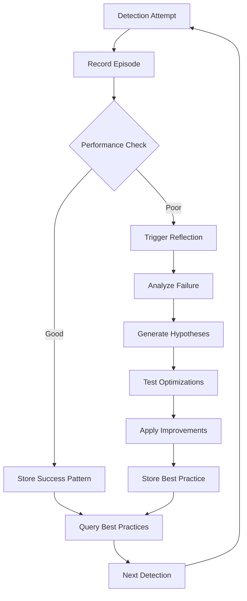

# ReasoningBank Integration - AI Defence ML System

## Overview

This document describes the integration of **AgentDB's ReasoningBank** framework with AI Defence for adaptive learning and coordination optimization.

## Architecture

```
┌─────────────────────────────────────────────────────────────────┐
│                     AI Defence ML System                         │
├─────────────────────────────────────────────────────────────────┤
│                                                                   │
│  ┌───────────────────────────┐  ┌─────────────────────────────┐ │
│  │  ReasoningBankCoordinator │  │     ReflexionEngine        │ │
│  ├───────────────────────────┤  ├─────────────────────────────┤ │
│  │ • Trajectory Storage      │  │ • Episode Recording         │ │
│  │ • Verdict Judgment        │  │ • Failure Analysis          │ │
│  │ • Memory Distillation     │  │ • Hypothesis Generation     │ │
│  │ • Best Practice Retrieval │  │ • Trajectory Optimization   │ │
│  │ • Neural Pattern Training │  │ • Critique Generation       │ │
│  └───────────┬───────────────┘  └──────────┬──────────────────┘ │
│              │                              │                     │
│              └──────────┬───────────────────┘                     │
│                         │                                         │
│                         ▼                                         │
│              ┌──────────────────────┐                            │
│              │ ThreatVectorStore    │                            │
│              ├──────────────────────┤                            │
│              │ • Pattern Storage    │                            │
│              │ • Vector Search      │                            │
│              │ • Cache Management   │                            │
│              └──────────┬───────────┘                            │
│                         │                                         │
└─────────────────────────┼─────────────────────────────────────────┘
                          │
                          ▼
            ┌─────────────────────────┐
            │   AgentDB (SQLite)      │
            ├─────────────────────────┤
            │ • Reflexion Episodes    │
            │ • Causal Edges          │
            │ • Skills Database       │
            │ • Vector Embeddings     │
            │ • Learning Patterns     │
            └─────────────────────────┘
```

## Components

### 1. ReasoningBankCoordinator

**Purpose**: Manages agent coordination learning using AgentDB's ReasoningBank capabilities.

**Key Methods**:

```javascript
// Record coordination trajectory
await coordinator.recordTrajectory(agentId, actions, outcome);

// Judge verdict (success/failure classification)
const verdict = await coordinator.judgeVerdict(trajectory);

// Extract reusable patterns
const patterns = await coordinator.distillMemory(trajectories);

// Query best practices
const bestPractice = await coordinator.queryBestPractice(scenario, options);

// Train neural patterns
await coordinator.trainPatterns(domain);
```

**RL Algorithms Supported**:
- Decision Transformer
- Q-Learning
- SARSA
- Actor-Critic
- Policy Gradient
- DQN (Deep Q-Network)
- A3C (Asynchronous Actor-Critic)
- PPO (Proximal Policy Optimization)
- DDPG (Deep Deterministic Policy Gradient)

### 2. ReflexionEngine

**Purpose**: Implements self-reflection for iterative detection improvement.

**Key Methods**:

```javascript
// Record detection episode
const episodeId = await reflexionEngine.recordEpisode(detection, outcome);

// Generate improvement hypotheses
const hypotheses = await reflexionEngine.generateHypotheses(analysis);

// Optimize trajectory
const optimized = await reflexionEngine.optimizeTrajectory(episode, hypotheses);

// Get reflection for episode
const reflection = reflexionEngine.getReflection(episodeId);
```

**Reflection Triggers**:
- Detection failures
- F1 score < 0.75
- Accuracy < 0.80
- Latency > 1000ms
- False positives > 5 or false negatives > 3

### 3. ThreatVectorStore

**Purpose**: High-performance vector storage for threat patterns using AgentDB.

**Key Methods**:

```javascript
// Store threat pattern
await vectorStore.storePattern(pattern);

// Query similar patterns
const similar = await vectorStore.querySimilarPatterns(query, options);

// Store coordination pattern
await vectorStore.storeCoordinationPattern(coordinationPattern);

// Store reflexion pattern
await vectorStore.storeReflexionPattern(episode, reflection);
```

**Features**:
- 768-dimensional vector embeddings
- Cosine similarity search
- LRU cache for frequent queries
- Import/export capabilities
- Pattern compression

## Integration Flow

### 1. Detection with Learning

```javascript
const { initializeLearning, recordDetectionWithLearning } = require('./learning');

// Initialize
const learningSystem = await initializeLearning({
  dbPath: './agentdb.db',
  minAttempts: 3,
  minSuccessRate: 0.6,
  minConfidence: 0.7
});

// Perform detection
const detection = {
  input: 'User prompt',
  type: 'prompt_injection',
  method: 'multimodal',
  parameters: { threshold: 0.75 }
};

const outcome = await performDetection(detection);

// Record for learning
const result = await recordDetectionWithLearning(
  learningSystem,
  detection,
  outcome
);

// Automatic reflection triggers if needed
if (result.reflection) {
  console.log('Reflection generated:', result.reflection.insights);
}
```

### 2. Continuous Improvement Loop



### 3. Pattern Learning Workflow

```javascript
// 1. Record multiple episodes
for (const detection of detectionAttempts) {
  await recordDetectionWithLearning(learningSystem, detection, outcome);
}

// 2. Distill patterns from successful episodes
const patterns = await coordinator.distillMemory();

console.log(`Extracted ${patterns.length} coordination patterns`);

// 3. Train neural patterns
await trainModels(learningSystem, 'threat-detection');

// 4. Query best practices for future detections
const bestPractice = await coordinator.queryBestPractice(
  'handle_prompt_injection',
  { k: 5, onlySuccesses: true }
);

// 5. Apply learned strategies
if (bestPractice.found) {
  detectionConfig.threshold = bestPractice.episodes[0].parameters.threshold;
  detectionConfig.method = bestPractice.episodes[0].method;
}
```

## AgentDB CLI Commands

The learning system uses AgentDB CLI for persistence:

```bash
# Initialize database
npx agentdb init ./agentdb.db --dimension 768 --preset medium

# Store reflexion episode
npx agentdb reflexion store <session-id> <task> <reward> <success> [critique]

# Retrieve episodes with synthesis
npx agentdb reflexion retrieve "authentication" --k 10 --synthesize-context

# Discover causal patterns
npx agentdb learner run 3 0.6 0.7

# Consolidate skills with ML pattern extraction
npx agentdb skill consolidate 3 0.7 7 true

# Query patterns with filters
npx agentdb query --query "successful detection" \
  --k 5 --synthesize-context \
  --filters '{"success":true,"reward":{"$gte":0.8}}'

# Train patterns
npx agentdb train --domain "threat-detection" --epochs 10 --batch-size 32

# Optimize memory
npx agentdb optimize-memory --compress true --consolidate-patterns true

# Get database statistics
npx agentdb stats ./agentdb.db

# Export for backup
npx agentdb export ./agentdb.db ./backup.json --compress

# Import from backup
npx agentdb import ./backup.json ./agentdb.db --decompress
```

## Performance Metrics

The learning system tracks comprehensive metrics:

```javascript
const metrics = getLearningMetrics(learningSystem);

console.log('Coordination Metrics:');
console.log('  Total Trajectories:', metrics.coordination.totalTrajectories);
console.log('  Success Rate:', metrics.coordination.successRate);
console.log('  Avg Reward:', metrics.coordination.avgReward);
console.log('  Patterns Extracted:', metrics.coordination.patternsExtracted);
console.log('  Coordination Efficiency:', metrics.coordination.coordinationEfficiency);

console.log('\nReflexion Metrics:');
console.log('  Episodes Recorded:', metrics.reflexion.episodesRecorded);
console.log('  Reflections Generated:', metrics.reflexion.reflectionsGenerated);
console.log('  Hypotheses Tested:', metrics.reflexion.hypothesesTested);
console.log('  Improvements:', metrics.reflexion.improvements);
console.log('  Avg Improvement Rate:', metrics.reflexion.avgImprovementRate);
```

## Hypothesis Generation Examples

### 1. Threshold Adjustment

**Trigger**: High false positives

**Hypothesis**:
```javascript
{
  type: 'threshold_adjustment',
  action: 'increase_threshold',
  parameters: {
    currentThreshold: 0.75,
    suggestedThreshold: 0.85
  },
  expectedImprovement: 0.15,
  confidence: 0.80
}
```

### 2. Method Enhancement

**Trigger**: Missed threats

**Hypothesis**:
```javascript
{
  type: 'method_enhancement',
  action: 'enable_advanced_detection',
  parameters: {
    methods: ['multimodal', 'neurosymbolic'],
    ensemble: true
  },
  expectedImprovement: 0.20,
  confidence: 0.85
}
```

### 3. Performance Optimization

**Trigger**: High latency

**Hypothesis**:
```javascript
{
  type: 'performance_optimization',
  action: 'optimize_performance',
  parameters: {
    enableCache: true,
    precompilePatterns: true,
    parallelDetection: true
  },
  expectedImprovement: 0.10,
  confidence: 0.90
}
```

## Verdict Judgment System

The coordinator uses multi-factor analysis for verdict judgment:

**Factors Analyzed**:
1. **Reward Threshold** (35% weight): Is reward >= minReward?
2. **Error Rate** (25% weight): Errors / Total Actions
3. **Completion Rate** (20% weight): Completed / Expected
4. **Latency Threshold** (10% weight): Latency < maxLatency?
5. **Resource Efficiency** (10% weight): Resources < maxResources?

**Example**:
```javascript
const verdict = await coordinator.judgeVerdict({
  actions: [...],
  outcome: {
    errors: 0,
    latency: 500,
    resourceUsage: 50,
    completed: 5,
    expected: 5
  },
  reward: 0.95,
  metadata: { maxLatency: 1000, maxResources: 100 }
});

// Result:
// {
//   verdict: 'success',
//   confidence: 0.93,
//   factors: { ... },
//   recommendation: 'Reinforce this coordination pattern'
// }
```

## Causal Edge Discovery

The system automatically discovers causal relationships:

```javascript
// After recording multiple trajectories, discover patterns
const patterns = await coordinator.distillMemory();

// Example discovered patterns:
[
  {
    cause: 'enable_multimodal_detection',
    effect: 'higher_recall',
    uplift: 0.25,
    confidence: 0.90,
    type: 'causal_pattern'
  },
  {
    cause: 'increase_threshold',
    effect: 'fewer_false_positives',
    uplift: 0.30,
    confidence: 0.85,
    type: 'causal_pattern'
  },
  {
    cause: 'enable_cache',
    effect: 'reduced_latency',
    uplift: 0.40,
    confidence: 0.95,
    type: 'causal_pattern'
  }
]
```

## Skill Consolidation

Successful patterns are consolidated into reusable skills:

```javascript
// AgentDB automatically consolidates skills from episodes
// with minAttempts=3, minReward=0.7, timeWindow=7 days

// Skills include:
// - Keyword frequency patterns
// - Critique patterns
// - Reward distributions
// - Metadata correlations
// - Learning curves

// Query consolidated skills
const bestPractice = await coordinator.queryBestPractice(
  'handle_adversarial_inputs',
  { k: 5, onlySuccesses: true }
);

// Skills are automatically available for retrieval
console.log('Found', bestPractice.episodes.length, 'skill episodes');
```

## Memory Optimization

Periodic optimization maintains database performance:

```javascript
// Perform memory optimization
await coordinator.optimizeMemory();

// This performs:
// 1. Pattern consolidation (merge similar patterns)
// 2. Memory compression (reduce storage footprint)
// 3. Episode pruning (remove outdated low-value episodes)
// 4. Skill quality assessment (prune underperforming skills)
```

## Benefits

### 1. Continuous Improvement
- System learns from every detection attempt
- Automatic pattern recognition
- Self-healing detection strategies

### 2. Adaptive Thresholds
- Dynamic threshold optimization
- Context-aware parameter tuning
- Reduced manual configuration

### 3. Root Cause Analysis
- Systematic failure analysis
- Actionable improvement recommendations
- Hypothesis-driven optimization

### 4. Knowledge Transfer
- Cross-agent pattern sharing
- Reusable skill consolidation
- Best practice propagation

### 5. Performance Optimization
- Reduced false positives/negatives over time
- Lower detection latency through caching
- Higher coordination efficiency

## Integration Testing

Run comprehensive tests:

```bash
# Run ReasoningBank tests
npm test tests/learning/reasoningbank.test.js

# Run ReflexionEngine tests
npm test tests/learning/reflexion-engine.test.js

# Run integration tests
npm test tests/learning/integration.test.js
```

## Monitoring & Observability

Monitor learning system performance:

```javascript
// Get real-time metrics
const metrics = getLearningMetrics(learningSystem);

// Export metrics for monitoring
console.log(JSON.stringify(metrics, null, 2));

// Track improvement over time
setInterval(async () => {
  const current = getLearningMetrics(learningSystem);
  console.log('Current efficiency:', current.coordination.coordinationEfficiency);
}, 60000); // Every minute
```

## See Also

- [AgentDB ReasoningBank Documentation](https://github.com/yourusername/agentdb)
- [Reflexion Framework Paper](https://arxiv.org/abs/2303.11366)
- [Learning Module README](../../npm-aimds/src/learning/README.md)
- [Threat Vector Store Documentation](../../npm-aimds/src/intelligence/README.md)
